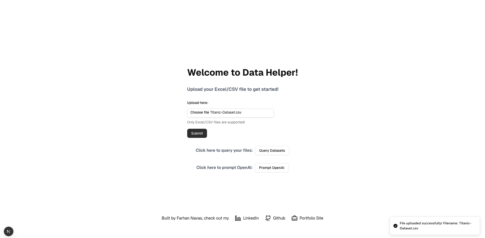
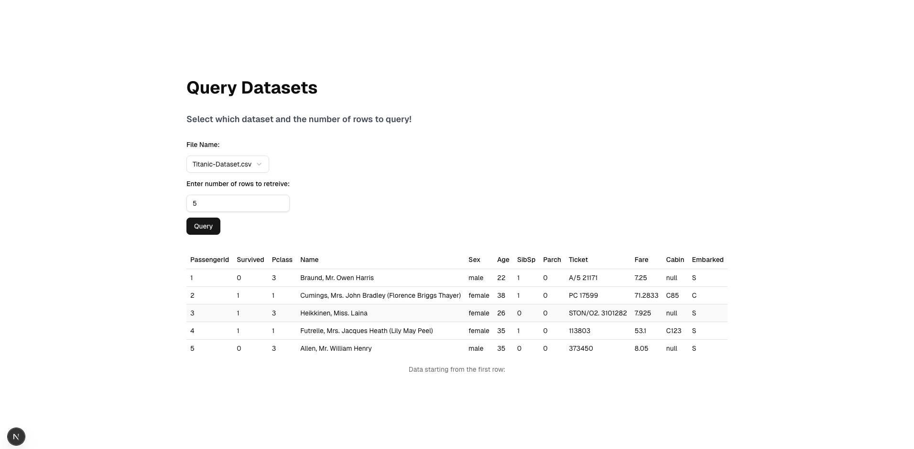
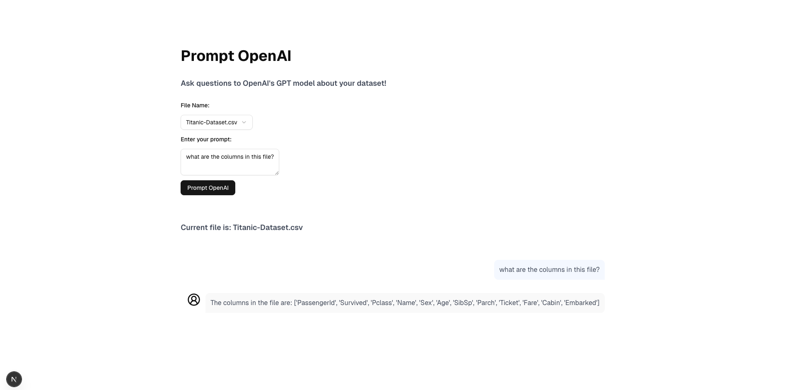

# Data Helper

Data helper is a full-stack app built using a Next.js frontend and a Python backend, which I created for the Cyber Sierra full stack challenge. Data Helper was built over the course of about 3/4 days, in the middle of a hectic school week (2 weeks before finals!!). Despite the tough time schedule, I am still quite proud of how it turned out :)

## Features

- Upload CSX/XLSX datasets
- Query top N rows from uploaded files
- Ask OpenAI natural language questions about dataset (with the help of PandasAI)
- View prompt/response history (in chat form) with OpenAI
- Support for charts/plots/graphs via OpenAI and matplotlib

## Frontend

I use Next.js, a very popular React framework, as I am very familiar with it. Next.js also provides alot of powerful functionality right off the bat such as server-side rendering, API routing and static site generation.

Using Next.js meant I had to do quite abit of custom styling, compared to if I used something like Streamlit for the frontend. However, this gave me the flexibility to build a cleaner and more responsive UI.

### Home Page

_Home page with submitted Titanic-dataset.csv_

### Query Dataset Page

_Query to get top N rows, and its display_

### Prompt OpenAI Page

_Asking OpenAI a natural language question about the dataset_

## Backend

The backend is built using Python + FastAPI. I chose FastAPI for several reasons:

- High performance (async support)
- Lightweight and modern design
- Native support for async routes and OpenAI streaming
- Automatic data validation and docs via Pydantic and OpenAPI

As NUS RHDevs Backend Head, I’ve had lots of experience working with Python & Flask backends. This meant that FastAPI felt familiar, but even more powerful and modern, especially for applications that involve AI integrations as I had read online.

I was also quite interested to use Microsoft's LIDA and I feel like it would've enhanced the app's ability to auto-generate descriptive stats or dashboards. Unfortunately, I ran out of time during the challenge, but if I had just a few more days, LIDA would have been the next feature I'd integrate.

## Deployment

I used Railway to deploy this app as I will be able to easily host both the Python FastAPI backend as well as the Next.js frontend, using a Monorepo config. The link to my live site is included in the repo bio, do check it out!
